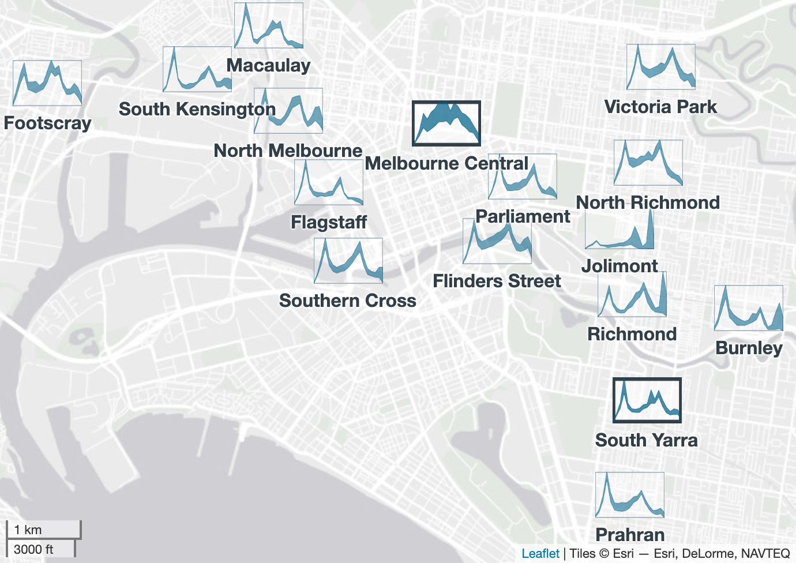

```{r}
#| label: setup
library(ggplot2)
library(dplyr)
library(grid)          # sugarglider::add_glyph_legend() needs grid attached
library(patchwork)
library(sugarglider)
library(cubble)
library(lubridate)
knitr::read_chunk("script.R")   # beach-data, beach-select

oz <- ozmaps::abs_ste

# UT Austin brand: burnt orange, charcoal + secondary blue / limestone / shade
pal <- list(ink = "#333F48", accent = "#BF5700", teal = "#005F86",
            base = "#ECEAE4", grid = "#9CADB7")

theme_poster <- function(base_size = 14) {
  theme_void(base_size = base_size) +
    theme(plot.background = element_rect(fill = "white", colour = NA),
          plot.title = element_text(face = "bold", colour = pal$ink,
                                    margin = margin(b = 6)),
          plot.title.position = "plot",
          legend.position = "bottom")
}
```

```{=typst}
// hl(...words)[code]: highlight the given words inside a code block
#let hl(..words, body) = {
  set par(leading: 0.6em)              // a little more room between code lines
  show raw: it => {
    show regex("\\b(" + words.pos().join("|") + ")\\b"): w => box(
      fill: rgb("#f9d3b4"), radius: 5pt, outset: (x: 2pt, top: 4pt, bottom: 6pt),
      text(weight: "bold", w))
    it
  }
  body
}
```


::: {.card accent="blue"}
## [2012]{.yr} From facets to a glyph map

Environmental data often come as **many time series at many locations**,
commonly shown as maps faceted by time. Below, monthly de-seasonalised
surface temperature over Central America for 1997–98.

```{r}
#| label: nasa-prep
nasa_ds <- GGally::nasa |>
  group_by(long, lat) |>
  mutate(diff = residuals(lm(surftemp ~ year + factor(month)))) |>
  ungroup()
lim_x <- range(nasa_ds$long) + c(-1.3, 1.3)
lim_y <- range(nasa_ds$lat) + c(-1.3, 1.3)
w <- 4.4; h <- 3.6                                   # glyph size (degrees)
nasa_ds <- nasa_ds |> filter(year %in% 1997:1998)    # the 24 panels shown
cell <- nasa_ds |> filter(x == 7, y == 9)            # highlighted Pacific cell
cell_box <- function(...) annotate("rect",
  xmin = cell$long[1] - w / 2, xmax = cell$long[1] + w / 2,
  ymin = cell$lat[1] - h / 2, ymax = cell$lat[1] + h / 2, fill = NA, ...)
nasa_thin <- nasa_ds |> filter(x %% 2 == 1, y %% 2 == 1)
# simplified land outline (Natural Earth 1:110m, no country borders,
# small islands dropped), shared by the faceted maps and the glyph map
sf::sf_use_s2(FALSE)
land <- rnaturalearth::ne_countries(scale = 110, returnclass = "sf") |>
  sf::st_union() |>
  sf::st_crop(xmin = lim_x[1] - 5, xmax = lim_x[2] + 5,
              ymin = lim_y[1] - 5, ymax = lim_y[2] + 5) |>
  sf::st_cast("POLYGON") |>
  sf::st_as_sf()
land <- land[as.numeric(sf::st_area(land)) > 5e10, ]
countries <- function(colour = "white", ...)
  geom_sf(data = land, colour = colour, inherit.aes = FALSE, ...)
```

```{r}
#| label: nasa-facet
#| fig-width: 5.2
#| fig-height: 4.6
nasa_ds |>
  mutate(panel = factor(format(date, "%b %y"),
                        levels = unique(format(sort(date), "%b %y")))) |>
  ggplot(aes(long, lat, fill = diff)) +
  geom_tile() +
  countries(fill = NA, colour = "grey25", linewidth = 0.3) +   # outline only: tiles cover land too
  cell_box(colour = pal$ink, linewidth = 0.35) +
  scale_fill_gradient2(low = pal$teal, mid = "white", high = pal$accent,
                       name = "De-seasonalised temperature (K)") +
  facet_wrap(~panel, ncol = 6) +
  coord_sf(xlim = lim_x, ylim = lim_y, expand = FALSE) +
  theme_poster(11) +
  theme(strip.text = element_text(size = 13, colour = pal$ink),
        panel.spacing = unit(6, "pt"),
        plot.margin = margin(0, 0, 0, 0),
        legend.margin = margin(2, 0, 0, 0),
        legend.key.height = unit(0.25, "cm"),
        legend.key.width = unit(1.4, "cm"),
        legend.title.position = "top")
```

::: {.side-by-side}
::: {}
**Trace one location.** Follow the boxed cell through the 24 panels to
get its time series. A **glyph map** draws that series as a small plot at
the cell's location [(Wickham et al., 2012)]{.cite}.
:::
::: {}
```{r}
#| label: nasa-steps
#| fig-width: 2.8
#| fig-height: 1.5
ggplot(cell, aes(as.Date(date), diff)) +
  geom_line(colour = pal$ink, linewidth = 0.4) +
  scale_x_date(date_breaks = "6 months", date_labels = "%b %y") +
  scale_y_continuous(breaks = c(0, 5)) +
  labs(x = NULL, y = "temp. (K)") +
  theme_bw(base_size = 13) +
  theme(panel.grid.minor = element_blank(),
        plot.background = element_rect(fill = "white", colour = NA))
```
:::
:::

**Do this for every location** to get the full glyph map
(`GGally::glyphs()` computes the glyph coordinates):

```{r}
#| label: nasa-glyph
#| fig-width: 5.2
#| fig-height: 4.75
ggplot(nasa_thin) +
  countries(fill = pal$base, linewidth = 0.2) +
  cell_box(colour = pal$accent, linewidth = 0.6) +
  geom_glyph(aes(x_major = long, y_major = lat, x_minor = time, y_minor = diff),
             width = w, height = h, colour = pal$ink, linewidth = 0.3) +
  coord_sf(xlim = lim_x, ylim = lim_y, expand = FALSE) +
  theme_poster(12) +
  theme(panel.background = element_rect(fill = "#e8f3ff", colour = NA))  # sea
```


::: {.takeaway}
<br>

**What the glyph map shows:**

- Equatorial eastern Pacific glyphs share one hump peaking in late 1997
  (the El Niño), fading away from the equator.
- Glyphs over land vary far more month to month than those over the sea.
:::
:::

::: {.colbreak}
:::

::: {.card}
## [2024]{.yr} `cubble`: glyph maps in ggplot2

 **How long after a storm is it safe to swim in Sydney?** 
 
 Each water sample (2015–2025) is matched to the most recent day with ≥ 20 mm of rain (a "very heavy rain" day in the ETCCDI climate-extremes indices), giving the number of days since rain when it was taken (0–6). For each site and each day, we take the percentage of samples above the bacteria guideline: 40 enterococci/100 mL, the limit for the best water-quality grade in Australia's recreational-water guidelines [(NHMRC, 2008)]{.cite}
[(TidyTuesday 2025-05-20)]{.cite}.

```{r beach-data}
```

```{r beach-select}
```

```{r}
#| label: syd-extras
eg <- beach |> filter(swim_site %in% c("Tambourine Bay", "Bondi Beach"))
water_col <- c(`Inner harbour` = pal$accent, `Ocean & outer harbour` = pal$teal)
```

```{r}
#| label: glyph-read
#| fig-width: 5.6
#| fig-height: 2.2
pt <- function(site, day, dy) {
  d <- filter(eg, swim_site == site, days_after_rain == day)
  annotate("text", x = d$days_after_rain, y = d$unsafe + dy,
           label = scales::percent(d$unsafe, accuracy = 1), size = 3.4,
           fontface = "bold", colour = water_col[[d$water]])
}
ggplot(eg, aes(days_after_rain, unsafe, colour = water, group = swim_site)) +
  annotate("rect", xmin = -0.4, xmax = 0.4, ymin = -Inf, ymax = Inf,
           fill = pal$base) +
  annotate("text", x = 0, y = 1.08, label = "rain day", size = 3.3,
           colour = pal$ink, fontface = "bold") +
  geom_line(linewidth = 0.9) +
  geom_point(size = 1.8) +
  pt("Tambourine Bay", 1, 0.09) + pt("Tambourine Bay", 3, 0.09) +
  pt("Bondi Beach", 1, 0.09) + pt("Bondi Beach", 2, -0.09) +
  annotate("text", x = 6.25, y = c(0.2, -0.02),
           label = c("Tambourine Bay", "Bondi Beach"), hjust = 0, size = 3.5,
           fontface = "bold", colour = c(pal$accent, pal$teal)) +
  scale_x_continuous(breaks = 0:6, expand = expansion(add = c(0.4, 2.4))) +
  scale_y_continuous(labels = scales::percent, breaks = c(0, 0.5, 1),
                     limits = c(-0.06, 1.13)) +
  scale_colour_manual(values = water_col, guide = "none") +
  labs(x = "days since ≥ 20 mm of rain  →  x_minor",
       y = NULL, title = "% of samples above guideline  →  y_minor") +
  theme_bw(base_size = 13) +
  theme(panel.grid.minor = element_blank(),
        panel.grid.major.x = element_blank(),
        axis.title = element_text(colour = pal$ink, face = "bold"),
        plot.title = element_text(colour = pal$ink, face = "bold", size = 13),
        plot.title.position = "plot",
        panel.border = element_rect(colour = pal$ink, linewidth = 0.8),
        plot.background = element_rect(fill = "white", colour = NA))
```

::: {.caption}
The two boxed glyphs below, full size: **Tambourine Bay** (inner
harbour) stays polluted for three days; **Bondi Beach** clears by day 2.
:::

`geom_glyph()` is a ggplot2 layer, so it combines with other layers
(a base map, site names), scales and themes:

```{=typst}
#hl("x_major", "y_major", "x_minor", "y_minor", "geom_glyph")[
```

```r
ggplot(beach, aes(x_major = long, y_major = lat,
                  x_minor = days, y_minor = percentage)) +
  geom_sf(..., inherit.aes = FALSE) +     # base map
  geom_glyph_box(...) + geom_glyph(...) + # cubble glyphs
  geom_text(...) +                        # site names
  theme(...)                              # theme
```

```{=typst}
]
```

```{r}
#| label: cubble-map
#| fig-width: 5.2
#| fig-height: 6.2

# glyph map: tightest extent around the glyph boxes and the names under them
xl <- range(beach$long) + c(-2, 2) * gw / 2
yl <- range(beach$lat) + c(-0.011, gh / 2 + 0.002)
eg_box <- distinct(eg, long, lat)

ggplot(beach, aes(x_major = long, y_major = lat, x_minor = days_after_rain, y_minor = unsafe,
                colour = water, group = swim_site)) +  
  geom_sf(data = sf::st_crop(sydney, xmin = xl[1], xmax = xl[2], ymin = yl[1], ymax = yl[2]),
          fill = pal$base, colour = NA, inherit.aes = FALSE) +   # land, cut to the panel
  geom_glyph_box(width = gw, height = gh, colour = pal$grid, fill = "white",
                 alpha = 0.08, linewidth = 0.2) +
  geom_glyph(width = gw, height = gh, linewidth = 0.55, key_glyph = "path") +
  annotate("rect", xmin = eg_box$long - gw / 2, xmax = eg_box$long + gw / 2,
           ymin = eg_box$lat - gh / 2, ymax = eg_box$lat + gh / 2,
           fill = NA, colour = pal$ink, linewidth = 0.9) +
  geom_text(data = distinct(beach, swim_site, long, lat),     # site names under glyphs
            aes(x = long, y = lat - 0.009, label = swim_site),
            inherit.aes = FALSE, size = 3.2, colour = pal$ink) +
  scale_colour_manual(values = water_col, name = NULL) +
  guides(colour = guide_legend(override.aes = list(linewidth = 1.5))) +
  coord_sf(xlim = xl, ylim = yl, expand = FALSE, clip = "off") +
  theme_poster(14) +
  theme(panel.background = element_rect(fill = "#e8f3ff", colour = NA))  # sea
```

::: {.takeaway}
- **Ocean & outer harbour** clear up by day 2 after a storm while **Inner harbour** needs until day 4–5.
- **Coogee** and **Rose Bay**, graded Poor by NSW Beachwatch, stay high.
:::
:::

::: {.colbreak}
:::

::: {.card accent="orange"}
## [2026]{.yr} `sugarglider`: interval segments

A line glyph shows **one value** per time point, but many summaries are
an **interval**: a low and a high value of the same measurement, such as
the daily minimum and maximum temperature. 

`geom_glyph_segment()` draws one bar per time point. Here: the monthly average daily low to high temperature at Australian weather stations, 2020.

```{=typst}
#hl("y_minor", "yend_minor", "geom_glyph_segment")[
```

```r
aus_temp |> 
  ggplot(aes(x_major = long, y_major = lat, x_minor = month,
             y_minor = tmin, yend_minor = tmax)) +
  add_glyph_boxes() + geom_glyph_segment() + 
  ...
```

```{=typst}
]
```

```{r}
#| label: segment-map
#| fig-width: 5.2
#| fig-height: 4.75
at <- aus_temp |> mutate(across(c(tmin, tmax), \(x) x / 10))  # tenths of °C -> °C
pick <- c(ASN00014274 = "Top End (coast)", ASN00015602 = "Central Australia")
sw <- 3.4; sh <- 2.2                              # glyph size (degrees)
boxed <- at |> filter(id %in% names(pick)) |> distinct(id, long, lat)
at |>
  ggplot(aes(x_major = long, y_major = lat, x_minor = month,
             y_minor = tmin, yend_minor = tmax)) +
  geom_sf(data = oz, fill = pal$base, colour = "white", inherit.aes = FALSE) +
  add_glyph_boxes(width = 3.4, height = 2.2, colour = pal$grid,
                  fill = "white", alpha = 0.1, linewidth = 0.2) +
  sugarglider::add_ref_lines(width = 3.4, height = 2.2, colour = pal$grid,
                             linewidth = 0.2) +
  geom_glyph_segment(width = 3.4, height = 2.2, colour = pal$accent,
                     linewidth = 0.6) +
  geom_rect(data = boxed, aes(xmin = long - sw / 2, xmax = long + sw / 2,
                              ymin = lat - sh / 2, ymax = lat + sh / 2),
            fill = NA, colour = pal$ink, linewidth = 0.9, inherit.aes = FALSE) +
  coord_sf(xlim = c(111.5, 155.5), ylim = c(-44.5, -8.8), expand = FALSE) +
  theme_poster(14)
```

The two boxed glyphs enlarged:

```{r}
#| label: segment-zoom
#| fig-width: 5.4
#| fig-height: 1.7
at |> filter(id %in% names(pick)) |>
  mutate(station = factor(pick[id], pick)) |>
  ggplot(aes(month, xend = month, y = tmin, yend = tmax)) +
  geom_segment(colour = pal$accent, linewidth = 1.6) +
  facet_wrap(~station) +
  scale_x_continuous(breaks = c(1, 4, 7, 10),
                     labels = c("Jan", "Apr", "Jul", "Oct")) +
  labs(x = NULL, y = "daily low–high (°C)") +
  theme_bw(base_size = 13) +
  theme(panel.grid.minor = element_blank(),
        strip.background = element_blank(),
        strip.text = element_text(face = "bold", colour = pal$ink),
        panel.border = element_rect(colour = pal$ink, linewidth = 0.8),
        plot.background = element_rect(fill = "white", colour = NA))
```

::: {.takeaway}
The **Top End** stays between 22 and 33 °C all year, with only 4–5 °C
between day and night. **Central Australia** swings from 3 °C winter
nights to 39 °C summer days, with 14–18 °C between day and night.
:::

:::

::: {.card accent="blue"}
## Take-home

1. **Glyph maps show space and time together.** Each location's time
   series is drawn where it belongs, so local patterns and their spatial
   structure can be explored in a single plot during exploratory
   analysis.
2. **Glyph maps are now part of ggplot2.** cubble provides line glyphs
   and sugarglider adds interval glyphs (segments and ribbons), and both
   combine with base maps, scales, colour and facets like any other
   layer.
3. **Glyph maps can be interactive.** The same glyphs can be placed on a
   leaflet map, so viewers can zoom into dense areas and look up
   individual locations.
:::

::: {.colbreak}
:::

::: {.card accent="orange"}
## [2026]{.yr} `sugarglider`: interval ribbons

**Ribbons** fill the band between a lower and an upper value. Hourly
weekday passengers at 16 inner Melbourne train stations, 2023–24
[(`sugarglider::train`)]{.cite}: for each hour, the **lower edge** is the
quietest month and the **upper edge** the busiest. Each station's glyph
is drawn on its own, saved as an image and added as a **leaflet** marker
with its name (simplified):

```{=typst}
#hl("ymin_minor", "ymax_minor", "geom_glyph_ribbon")[
```

```r
glyph <- ggplot(station,
  aes(x_major = long, y_major = lat, x_minor = hour,
      ymin_minor = min_weekday, ymax_minor = max_weekday)) +
  add_glyph_boxes() + geom_glyph_ribbon() + theme_void()
ggsave("glyph.png", glyph, bg = "transparent")

leaflet() |> addProviderTiles("Esri.WorldGrayCanvas") |>
  addMarkers(lng, lat, icon = makeIcon("glyph.png", 54, 36),
             label = name, labelOptions(noHide = TRUE))
```

```{=typst}
]
```

```{r}
#| label: train-prep
tr <- sugarglider::train |>
  mutate(hr = as.numeric(substr(as.character(hour), 1, 2)))
```

Because each glyph is drawn alone, every station gets **its own scale**:
the glyphs compare the shape of the day, not how busy a station is.

{width=100%}

The two boxed glyphs enlarged, with their own axes:

```{r}
#| label: train-zoom
#| fig-width: 5.4
#| fig-height: 1.8
zoom <- tr |> filter(station_name %in% c("Melbourne Central", "South Yarra")) |>
  mutate(station_name = factor(station_name,
                               c("Melbourne Central", "South Yarra")))
lab <- zoom |> filter(station_name == "Melbourne Central", hr == 14)
ggplot(zoom, aes(hr, ymin = min_weekday, ymax = max_weekday)) +
  geom_ribbon(fill = pal$teal, alpha = 0.55, colour = pal$teal, linewidth = 0.4) +
  geom_text(data = lab, aes(x = hr, y = max_weekday, label = "busiest month"),
            vjust = -0.6, size = 3.4, colour = pal$ink, inherit.aes = FALSE) +
  geom_text(data = lab, aes(x = hr, y = min_weekday, label = "quietest month"),
            vjust = 1.6, size = 3.4, colour = pal$ink, inherit.aes = FALSE) +
  facet_wrap(~station_name, scales = "free_y") +
  scale_y_continuous(expand = expansion(mult = c(0.3, 0.35))) +
  scale_x_continuous(breaks = c(6, 12, 18),
                     labels = c("6am", "12pm", "6pm")) +
  labs(x = NULL, y = "passengers/hr") +
  theme_bw(base_size = 13) +
  theme(panel.grid.minor = element_blank(),
        strip.background = element_blank(),
        strip.text = element_text(face = "bold", colour = pal$ink),
        panel.border = element_rect(colour = pal$grid, linewidth = 0.5),
        plot.background = element_rect(fill = "white", colour = NA))
```

::: {.takeaway}
- Most stations follow the **working day**: peaks at 8am and 5pm.
- **Melbourne Central** is busy all day, busier at midday than at 8am.
- **Jolimont**, **Richmond** and **Burnley** jump at 10pm in some months:
  event crowds from the MCG and sports precinct.
:::
:::

::: {.card}
**Questions?** Email **hsherryzhang\@utexas.edu**

```{r}
#| label: qr
#| fig-width: 5.2
#| fig-height: 1.4
qr_plot <- function(url, label) {
  m <- qrcode::qr_code(url) |> unclass()
  df <- expand.grid(y = rev(seq_len(nrow(m))), x = seq_len(ncol(m)))
  df$on <- as.vector(m)
  ggplot(df[df$on, ], aes(x, y)) +
    geom_tile(fill = pal$ink) +
    coord_fixed() +
    labs(title = label) +
    theme_void(base_size = 9) +
    theme(plot.title = element_text(hjust = 0.5, face = "bold",
                                    colour = pal$ink, lineheight = 0.9))
}
qr_plot("https://doi.org/10.32614/RJ-2026-050", "sugarglider\npaper") +
  qr_plot("https://maliny12.github.io/sugarglider/", "sugarglider\npackage") +
  qr_plot("https://huizezhang-sherry.github.io/cubble/", "cubble\npackage") +
  qr_plot("https://github.com/huizezhang-sherry/envrworkshop2026", "poster\ncode") +
  plot_layout(nrow = 1)
```

```{=typst}
#set text(size: 19pt, fill: ut-muted)
#set par(spacing: 0.5em)
```

Wickham, Hofmann, Wickham & Cook (2012). Glyph-maps for visually exploring
temporal patterns in climate data and models. *Environmetrics* 23(5), 382–393.
[doi:10.1002/env.2152](https://doi.org/10.1002/env.2152)

Zhang, Cook, Laa, Langrené & Menéndez (2024). cubble: An R package for
organizing and wrangling multivariate spatio-temporal data.
*J. Stat. Softw.* 110(7).
[doi:10.18637/jss.v110.i07](https://doi.org/10.18637/jss.v110.i07)

Po, Yang, Zhang & Cook (2026). sugarglider: Create glyph-maps of
spatiotemporal data. *The R Journal* 18(3), 286–304.
[doi:10.32614/RJ-2026-050](https://doi.org/10.32614/RJ-2026-050)

:::
